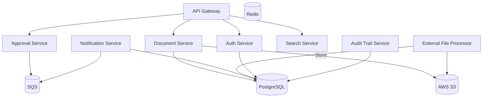

# 🗂️ Distributed Document Management System (DDMS)

A microservice-based backend system for secure document storage, metadata management, approval workflows, and lifecycle tracking — designed with scalability, testability, and cloud deployment (AWS) in mind.

---

## 📌 Table of Contents

- [Overview](#-overview)
- [Architecture](#-architecture)
- [Key Features](#-key-features)
- [Tech Stack](#-tech-stack)
- [Service Overview](#-service-overview)
- [Getting Started](#-getting-started)
- [Environment Variables](#-environment-variables)
- [Deployment](#-deployment)
- [Roadmap](#-roadmap)
- [License](#-license)

---

## 📖 Overview

DDMS is a backend-only distributed system for document handling in enterprise settings. It provides a secure and auditable platform for:

- File upload and versioning
- Approval workflows
- Document lifecycle automation
- Role-based access control (RBAC)
- Integration with external services (OCR, virus scanning, ML classification)
- Scalable cloud-native architecture

---

## 🏗️ Architecture



## ✨ Key Features
🔐 Secure Upload: File validation, virus scan hooks, metadata tagging

📜 Version Control: Auto-versioning of document updates

✅ Approval Workflow: Multi-reviewer decision system with timeouts

🔎 Search: Metadata and content-based full-text search

🧑‍⚖️ RBAC: JWT-based auth with roles (Admin, Reviewer, Uploader, Viewer)

🧾 Audit Trail: Every action is tracked immutably

📨 Notification System: Email/webhook updates

🧠 Extensible: Plug in OCR, ML document classifiers, etc.

☁️ Cloud-Ready: Deploy to AWS with Docker & GitHub Actions


## 🧰 Tech Stack
| Category         | Technology                      |
| ---------------- | ------------------------------- |
| Language         | .NET 8 (C#)                     |
| API Gateway      | YARP / Ocelot                   |
| Communication    | REST, SQS, gRPC (optional)      |
| Database         | PostgreSQL                      |
| Caching          | Redis                           |
| File Storage     | AWS S3 (or MinIO locally)       |
| Message Queue    | AWS SQS / RabbitMQ              |
| Background Jobs  | Hangfire                        |
| Auth             | JWT, ASP.NET Identity           |
| Containerization | Docker + Docker Compose         |
| CI/CD            | GitHub Actions + AWS ECS        |
| Observability    | OpenTelemetry, Serilog, Grafana |

## 🧩 Service Overview
| Service              | Description                                   |
| -------------------- | --------------------------------------------- |
| **Document Service** | Upload, metadata, versioning, file management |
| **Approval Service** | Reviewer workflows, state transitions         |
| **Auth Service**     | Users, roles, JWT issuance                    |
| **Search Service**   | Full-text & metadata indexing                 |
| **Notification**     | Sends email or webhook notifications          |
| **Audit Log**        | Stores immutable action logs                  |
| **File Processor**   | OCR, classification, virus scan integrations  |
| **API Gateway**      | Entry point, auth forwarding, service routing |


## 🚀 Getting Started

### 🖥 Prerequisites
- .NET 9 SDK
- Docker & Docker Compose
- AWS CLI (for deployment)
- PostgreSQL client (e.g., DBeaver, psql)

### ⚙️ Local Development
1. Clone the repo

```bash
git clone https://github.com/yourusername/ddms.git
cd ddms
```
2. Setup environment variables
   - Copy .env.example to each service directory and fill in your config.

4. Start services
```bash
docker-compose up --build
```
Access API

Gateway: http://localhost:8000

Swagger UI per service: http://localhost:PORT/swagger

### ⚙️ Environment Variables
Each service has its own .env file. Required keys:
```env
# Common
ASPNETCORE_ENVIRONMENT=Development
JWT_SECRET=your-long-secret
DATABASE_URL=postgres://...

# S3
AWS_ACCESS_KEY_ID=...
AWS_SECRET_ACCESS_KEY=...
AWS_REGION=us-east-1
S3_BUCKET=ddms-files
```
## ☁️ Deployment
- Push Docker images to ECR
- Use Terraform or AWS Copilot to deploy ECS services
- Configure Load Balancer + HTTPS via ACM
- Use GitHub Actions for CI/CD (build → test → push → deploy)
  
> A production-ready GitHub Actions pipeline is provided in .github/workflows/deploy.yml

##  🛣️ Roadmap
-  Document upload + versioning
-  Basic approval workflow
- JWT authentication + RBAC
- Full-text search via ElasticSearch
- Event sourcing for audit logs
- AI classification integration
- Organization/team-based multitenancy
- OpenTelemetry + Grafana dashboard
- Service mesh (e.g., Istio or Linkerd)

## 📄 License
This project is licensed under the MIT License.


